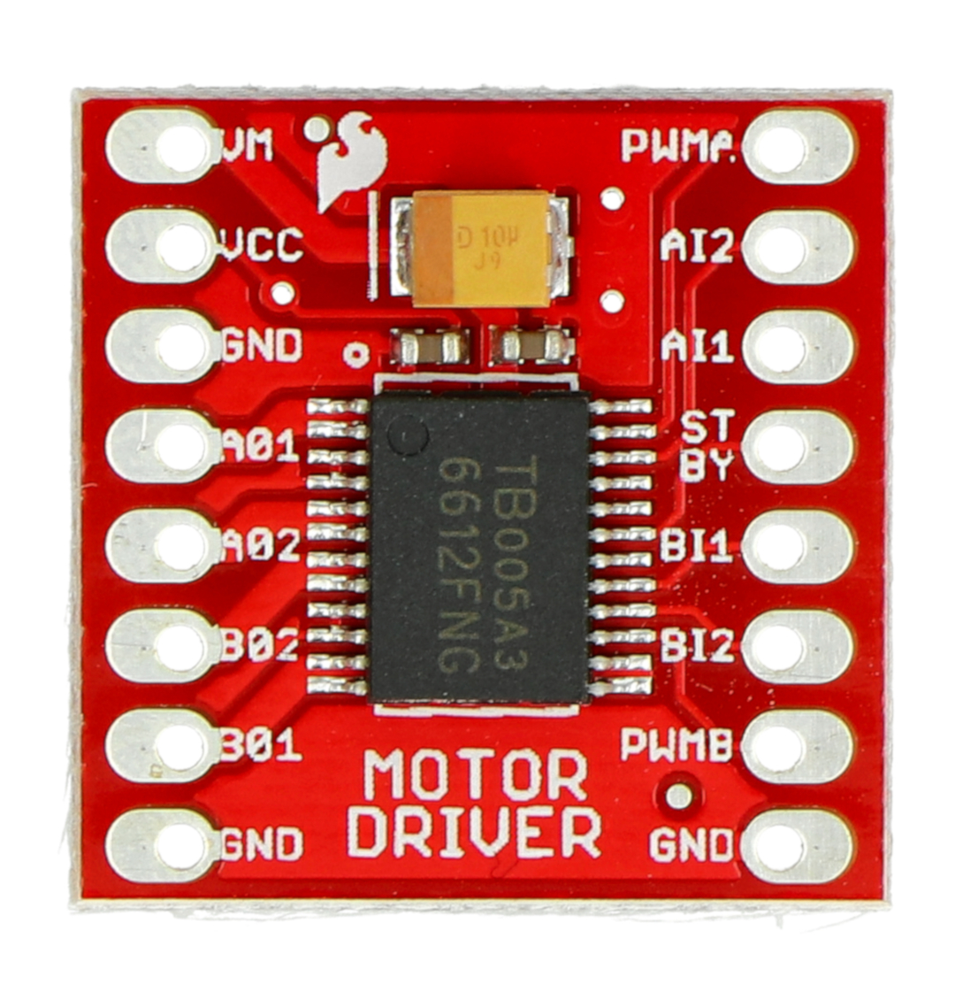
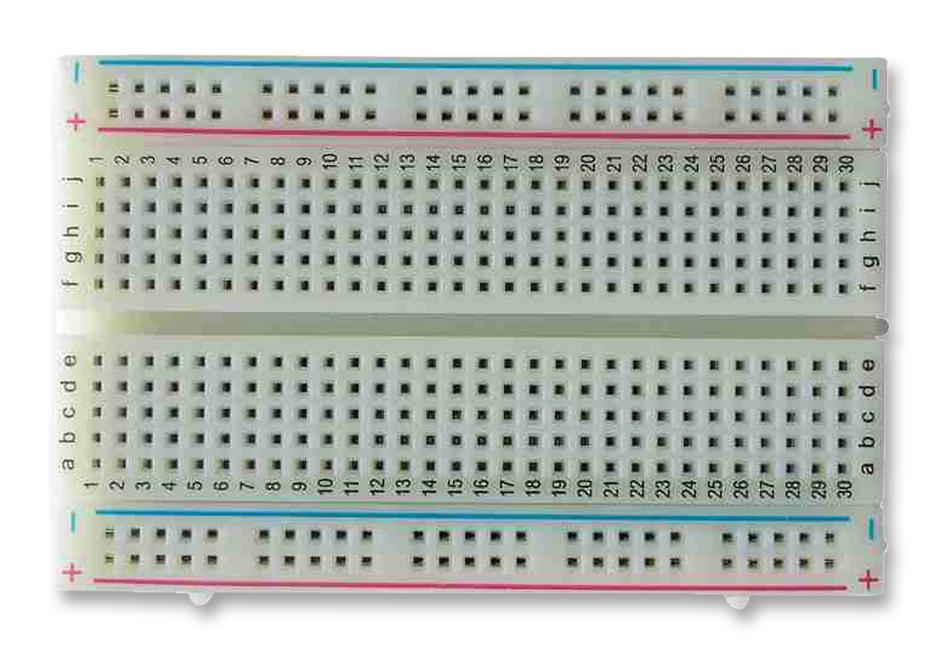

# Obelix 1.0 — Components List with Images

1. **Arduino Uno**
   - **Description:** Microcontroller for controlling sensors and motors.
   - **Quantity:** 1
   - **Image:** 

2. **Force-Up 6V 1000 RPM Carbon Brushed DC Motor**
   - **Description:** High-torque motor for differential drive wheels.
   - **Quantity:** 1
   - **Image:** 

3. **SG90 Servo Motor**
   - **Description:** Controls front wheels via Ackerman steering.
   - **Quantity:** 1
   - **Image:** 

4. **HC-SR04 Ultrasonic Sensors**
   - **Description:** Measures distance to obstacles.
   - **Quantity:** 4 (1 front, 2 sides, 1 rear)
   - **Image:** 

5. **TCS3200 Color Sensor**
   - **Description:** Detects color for navigation.
   - **Quantity:** 1
   - **Image:** 

6. **TB6612FNG Motor Driver**
   - **Description:** Controls DC motor speed and direction.
   - **Quantity:** 1
   - **Image:** 

7. **XL4015 Voltage Regulator**
   - **Description:** Provides stable voltage to motors.
   - **Quantity:** 1
   - **Image:** 

8. **Batteries**
   - **Description:** Power supply for Arduino and motors.
   - **Li-ion 18650:** 2 cells for Arduino
     - **Image:** 
   - **AA Batteries:** 6 for motors
     - **Image:** 

9. **Breadboard**
   - **Description:** For power distribution (GND and VCC) and connections.
   - **Quantity:** 1
   - **Image:** 

10. **Differential LEGO System**
    - **Description:** Custom LEGO assembly to transmit motor torque to wheels.
    - **Quantity:** 1 assembly
    - **Image:** 

11. **Wheels and Tires**
    - **Description:** Front wheels mounted with SG90 servo (Ackerman system), rear wheels driven by differential.
    - **Quantity:** 4 wheels + 4 tire pieces
    - **Image:** 

12. **Bolts and Screws**
    - **Description:** Assembly for Ackerman system and wheel mounts.
    - **Quantity:** 2 × 3mm × 15mm bolts (front wheels), 6 smaller bolts for Ackerman system
    - **Image:** 

13. **Connecting Wires**
    - **Description:** ~40 wires used for electrical connections and forming tire structure from bicycle tube material.
    - **Quantity:** ~40
    - **Image:** 

14. **Miscellaneous**
    - **Description:** 3D-printed parts, mounts, and connectors for sensors, motors, and servo.
    - **Quantity:** As required
    - **Image:** 

---

**Note:**  
- Images are placeholders and should be replaced with actual photos or uploaded files.  
- All parts are assembled to ensure unobstructed wheel rotation, proper sensor placement, and reliable power supply.
